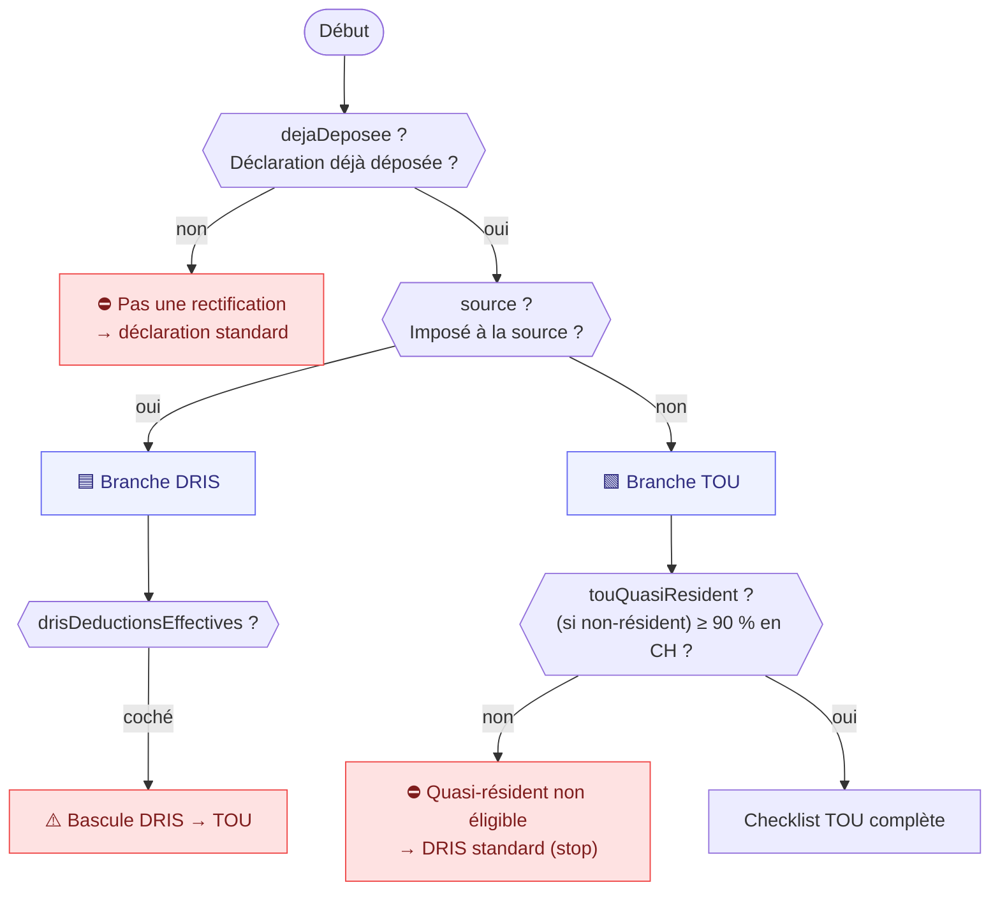

# Arbre de décision — « Déclaration rectificative »

> ⚙️ **Document généré** par `scripts/generate-rectificative-doc.ts` à partir du template
> (`src/data/templates/declaration-rectificative.ts`). Ne pas éditer à la main : relancer le script.
> Conditions évaluées par `evalCondition` (`src/lib/questionnaire/engine.ts`).

Assistant **conditionnel** : un gate + des règles `IF condition THEN documents`. Deux branches selon
l'imposition à la source — **DRIS** (impôt à la source) et **TOU** (déclaration ordinaire, dont
quasi-résidents). Échéance GE : dépôt au plus tard le **31 mars** de l'année N+1.

Total : **48 pièces** (7 obligatoires · 35 conditionnelles · 6 recommandées) sur 4 sections.

## 1. Vue d'ensemble

## 2. Court-circuits « durs » (logique, pas seulement affichage)

- **`notRectificativeAlert`** — `dejaDeposee` = non → ce n'est pas une rectification (ouvrir une déclaration standard).
- **`drisToTouAlert`** — `source` = oui **ET** `drisDeductionsEffectives` répondu → bascule DRIS → TOU.
- **`notEligibleTouAlert`** — `statutResidence` = non_resident **ET** `touQuasiResident` = non → quasi-résident non éligible → DRIS standard (arrêt de la collecte TOU).

## 3. Questions par section

### Section « Orientation du dossier »  `(orientation)`
| Question (id) | Type | Visible si | Déclenche |
| --- | --- | --- | --- |
| Votre demande concerne-t-elle une personne imposée à la source ? `(source)` | single | — | — |
| La déclaration initiale a-t-elle déjà été déposée ? `(dejaDeposee)` | single | — | — |
| Avez-vous reçu une décision de taxation ? `(decisionTaxation)` | single | `dejaDeposee` = oui | `decision-taxation`, `bordereau`, `copie-declaration-initiale` |
| Date de notification de la décision `(dateNotification)` | date | `decisionTaxation` = oui | — |
| Quel est le motif principal de rectification ? `(motif)` | multi | `dejaDeposee` = oui | — |

### Section « Identification du dossier »  `(identification)`

_Visible si : `dejaDeposee` = oui_

| Question (id) | Type | Visible si | Déclenche |
| --- | --- | --- | --- |
| Nom et prénom `(nomPrenom)` | text | — | — |
| Date de naissance `(dateNaissance)` | date | — | — |
| Adresse `(adresse)` | text | — | — |
| Téléphone `(telephone)` | text | — | — |
| E-mail `(email)` | text | — | — |
| Numéro de contribuable / numéro fiscal `(numContribuable)` | text | — | — |
| Année fiscale concernée `(anneeFiscale)` | number | — | — |
| Canton concerné `(canton)` | single | — | — |
| Statut de résidence au 31.12 `(statutResidence)` | single | — | — |
| État civil au 31 décembre de l’année fiscale `(etatCivil)` | single | — | — |
| Motif libre de rectification `(motifLibre)` | text | — | — |
| B&B agit-il auprès de l’administration ? `(mandatBB)` | single | — | `mandat-procuration` |

### Section « Rectification impôt à la source (DRIS) »  `(dris)`

_Visible si : `source` = oui ET `dejaDeposee` = oui_

| Question (id) | Type | Visible si | Déclenche |
| --- | --- | --- | --- |
| Employeur(s) durant l’année `(drisEmployeurs)` | text | — | — |
| Le salaire imposé à la source est-il correct ? `(drisSalaireCorrect)` | single | — | — |
| Le barème appliqué est-il correct ? `(drisBaremeCorrect)` | single | — | — |
| Le taux appliqué est-il correct ? `(drisTauxCorrect)` | single | — | — |
| Le conjoint a-t-il un revenu ? `(drisConjointRevenu)` | single | — | `conjoint-revenus` |
| Un enfant n’a-t-il pas été pris en compte ? `(drisEnfantNonPris)` | single | — | — |
| Garde alternée, concubinage, PACS, séparation ou divorce ? `(drisGarde)` | single | — | `jugement-garde` |
| Souhaitez-vous faire valoir des déductions effectives ? `(drisDeductionsEffectives)` | multi | — | — |

### Section « Déclaration ordinaire rectificative (TOU) »  `(tou)`

_Visible si : `source` = non ET `dejaDeposee` = oui_

| Question (id) | Type | Visible si | Déclenche |
| --- | --- | --- | --- |
| Non-résident : 90 % des revenus mondiaux imposables en Suisse ? `(touQuasiResident)` | single | `statutResidence` = non_resident | `revenus-mondiaux`, `avis-imposition-etranger` |
| Revenus annuels bruts ≥ CHF 120’000 ? `(touRevenus120k)` | single | — | — |
| Revenus non soumis à l’impôt à la source ≥ CHF 3’000 ? `(touRevenusNonSource)` | single | — | — |
| Fortune imposable ? `(touFortune)` | single | — | `releves-bancaires`, `etat-titres` |
| Propriétaire immobilier ? `(touProprietaire)` | single | — | `immo-estimation`, `immo-interets`, `immo-travaux` |
| Activité indépendante ? `(touIndependant)` | single | — | `indep-comptes` |
| Situation du conjoint `(touConjoint)` | single | — | — |
| Le conjoint perçoit-il un revenu hors de Suisse ? `(touConjointEtranger)` | single | — | `attestation-revenu-etranger-conjoint` |
| Enfants à charge ? `(touEnfants)` | single | — | `attestation-charge-enfant` |
| Frais professionnels effectifs (> forfait 3 %) ? `(touFraisProReels)` | single | — | — |
| Pension alimentaire versée ? `(touPensionVersee)` | single | — | `pension-versee` |
| Pension alimentaire reçue ? `(touPensionRecue)` | single | — | `pension-recue` |
| Propriétaire d’un bien hors CH ? `(touPropEtranger)` | single | — | `pieces-bien-etranger` |
| Revenus locatifs ? `(touBienLoue)` | single | — | `etat-locatif` |
| Bien immobilier acquis dans l’année ? `(touBienAcquis)` | single | — | `acte-achat` |
| Détention de cryptomonnaies ? `(touCrypto)` | single | — | `releve-crypto` |
| Dons à des organisations reconnues ? `(touDons)` | single | — | `attestation-dons-tou` |
| Versements à un parti politique ? `(touPartiPolitique)` | single | — | `recu-parti` |
| Proche nécessiteux à charge ? `(touProche)` | single | — | `justif-proche` |
| Frais liés à un handicap ? `(touHandicap)` | single | — | `justif-handicap` |

## 4. Catalogue des pièces (condition de déclenchement)

| Pièce (id) | Catégorie | Obligation | Demandée si |
| --- | --- | --- | --- |
| Copie de la déclaration initiale déposée `(copie-declaration-initiale)` | Identification du dossier | recommandé | `dejaDeposee` = oui |
| Décision de taxation `(decision-taxation)` | Identification du dossier | **obligatoire** | `decisionTaxation` = oui |
| Bordereau d’impôt `(bordereau)` | Identification du dossier | **obligatoire** | `decisionTaxation` = oui |
| Courrier de l’administration fiscale `(courrier-admin)` | Identification du dossier | recommandé | `dejaDeposee` = oui |
| Mandat / procuration B&B `(mandat-procuration)` | Pièces administratives | conditionnel | `mandatBB` = oui |
| Vos certificats de salaire suisses `(dris-certificats-salaire)` | Revenus | **obligatoire** | `source` = oui |
| Vos décomptes de salaire mensuels `(dris-decomptes-mensuels)` | Revenus | conditionnel | `drisSalaireCorrect` = non |
| Attestation d’impôt à la source / certificats de retenue `(dris-attestation-source)` | Revenus | **obligatoire** | `source` = oui |
| Justificatifs des revenus de votre conjoint `(conjoint-revenus)` | Revenus | conditionnel | `drisConjointRevenu` = oui |
| Attestation d’études ou d’apprentissage (enfant majeur) `(enfant-etudes)` | Événements familiaux | conditionnel | `drisEnfantNonPris` = oui OU `motif` ∈ {enfant_charge} OU `touEnfants` = oui |
| Jugement ou convention (garde / pension / séparation) `(jugement-garde)` | Événements familiaux | conditionnel | `drisGarde` ∈ {garde_alternee, separation, divorce, pacs} |
| Justificatif de domicile et de situation familiale `(justif-domicile)` | Pièces administratives | recommandé | `source` = oui |
| Vos certificats de salaire `(tou-certificats-salaire)` | Revenus | **obligatoire** | `source` = non |
| Indemnités (chômage, maladie, accident, maternité) `(tou-indemnites)` | Revenus | conditionnel | `motif` ∈ {erreur_revenu} |
| Attestations de rentes (AVS/AI/LPP/étrangères) `(tou-rentes)` | Revenus | conditionnel | `motif` ∈ {erreur_revenu} |
| Comptes de votre activité indépendante `(indep-comptes)` | Revenus | conditionnel | `touIndependant` = oui OU `motif` ∈ {activite_independante} |
| Relevés bancaires fiscaux / attestations d’intérêts `(releves-bancaires)` | Fortune et comptes | conditionnel | `touFortune` = oui OU `motif` ∈ {fortune_compte_titre} |
| État des titres (dividendes, gains, crypto) `(etat-titres)` | Fortune et comptes | conditionnel | `touFortune` = oui OU `motif` ∈ {fortune_compte_titre} |
| Estimation fiscale du bien immobilier `(immo-estimation)` | Immobilier | conditionnel | `touProprietaire` = oui OU `motif` ∈ {immobilier} |
| Intérêts hypothécaires et état de la dette `(immo-interets)` | Immobilier | conditionnel | `touProprietaire` = oui OU `motif` ∈ {immobilier} |
| Factures de travaux d’entretien `(immo-travaux)` | Immobilier | recommandé | `touProprietaire` = oui OU `motif` ∈ {immobilier} |
| Dettes et intérêts (hypothèque, prêts, cartes) `(dettes-interets)` | Dettes | conditionnel | `motif` ∈ {dette_interets} |
| Primes d’assurance maladie et subside `(assurance-maladie)` | Assurances et prévoyance | conditionnel | `motif` ∈ {deduction_oubliee} |
| Attestation 3e pilier A `(3a)` | Déductions | conditionnel | `drisDeductionsEffectives` ∈ {3a} OU `motif` ∈ {deduction_oubliee} |
| Attestation de rachat 2e pilier (LPP) `(rachat-lpp)` | Déductions | conditionnel | `drisDeductionsEffectives` ∈ {rachat_lpp} OU `motif` ∈ {deduction_oubliee} |
| Frais de garde des enfants `(frais-garde)` | Déductions | conditionnel | `drisDeductionsEffectives` ∈ {garde} OU `motif` ∈ {deduction_oubliee} |
| Frais de formation `(frais-formation)` | Déductions | conditionnel | `drisDeductionsEffectives` ∈ {formation} OU `motif` ∈ {deduction_oubliee} OU `touFraisProReels` = oui |
| Frais médicaux importants non remboursés `(frais-medicaux)` | Déductions | recommandé | `motif` ∈ {deduction_oubliee} |
| Pensions alimentaires versées ou reçues `(pensions)` | Déductions | conditionnel | `motif` ∈ {changement_familial, enfant_charge} OU `drisGarde` ∈ {separation, divorce} |
| Justificatifs de vos revenus mondiaux `(revenus-mondiaux)` | Revenus | conditionnel | `touQuasiResident` = oui |
| Avis d’imposition / déclaration fiscale étrangère `(avis-imposition-etranger)` | Pièces administratives | conditionnel | `statutResidence` = non_resident |
| Pièce d’identité (passeport / carte d’identité) `(piece-identite)` | Pièces administratives | **obligatoire** | `dejaDeposee` = oui |
| Attestation des primes d’assurance-maladie (LAMal + complémentaires) `(tou-primes-maladie)` | Assurances et prévoyance | **obligatoire** | `source` = non |
| Attestation du revenu étranger du conjoint `(attestation-revenu-etranger-conjoint)` | Revenus | conditionnel | `touConjointEtranger` = oui |
| Attestation de charge / acte de naissance (par enfant) `(attestation-charge-enfant)` | Événements familiaux | conditionnel | `touEnfants` = oui |
| Pension alimentaire versée (preuves + bénéficiaire) `(pension-versee)` | Déductions | conditionnel | `touPensionVersee` = oui |
| Pension alimentaire reçue (attestation des montants) `(pension-recue)` | Revenus | conditionnel | `touPensionRecue` = oui |
| Justificatifs de frais de déplacement professionnels `(frais-deplacement)` | Déductions | conditionnel | `touFraisProReels` = oui |
| Attestation employeur (repas / cantine) `(frais-repas)` | Déductions | conditionnel | `touFraisProReels` = oui |
| Décompte de charges de copropriété (PPE) `(charges-ppe)` | Immobilier | recommandé | `touProprietaire` = oui |
| Acte d’achat du bien immobilier `(acte-achat)` | Immobilier | conditionnel | `touBienAcquis` = oui |
| État locatif / quittances de loyers perçus `(etat-locatif)` | Immobilier | conditionnel | `touBienLoue` = oui |
| Pièces du bien immobilier à l’étranger `(pieces-bien-etranger)` | Immobilier | conditionnel | `touPropEtranger` = oui |
| Relevés de portefeuille de cryptomonnaies au 31.12 `(releve-crypto)` | Fortune et comptes | conditionnel | `touCrypto` = oui |
| Attestations de dons (organisations reconnues) `(attestation-dons-tou)` | Déductions | conditionnel | `touDons` = oui |
| Reçus de versement à un parti politique `(recu-parti)` | Déductions | conditionnel | `touPartiPolitique` = oui |
| Justificatifs de prise en charge d’un proche nécessiteux `(justif-proche)` | Déductions | conditionnel | `touProche` = oui |
| Justificatifs des frais liés à un handicap `(justif-handicap)` | Déductions | conditionnel | `touHandicap` = oui |
