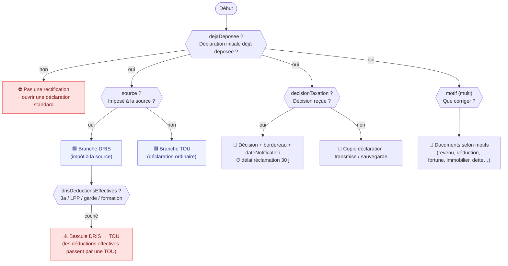

# Arbre de décision — « Déclaration rectificative »

> Source : `src/data/templates/declaration-rectificative.ts`.
> Les conditions sont évaluées par `evalCondition` (`src/lib/questionnaire/engine.ts`).
> Document généré automatiquement — voir aussi `npm run gen:rectificative-tree`.

L'assistant est **conditionnel** (pas une checklist statique). Deux branches mutuellement
exclusives selon l'imposition à la source :

- **DRIS** — rectification de l'impôt à la source (salaire, barème, taux, conjoint, enfants).
- **TOU** — déclaration ordinaire rectificative complète (revenus, fortune, dettes, immobilier, déductions).

> Échéance GE : dépôt DRIS/TOU au plus tard le **31 mars** de l'année suivant l'imposition.

---

## 1. Vue d'ensemble (flux)

---

## 2. Orientation (qualification)

| Question | id | Type | Visible si | Effet |
| --- | --- | --- | --- | --- |
| Imposé à la source ? | `source` | oui/non | toujours | **oui → DRIS**, **non → TOU** |
| Déclaration initiale déjà déposée ? | `dejaDeposee` | oui/non | toujours | **non → ⛔ pas une rectification** ; oui → suite |
| Décision de taxation reçue ? | `decisionTaxation` | oui/non | `dejaDeposee=oui` | oui → décision + bordereau + date ; non → copie déclaration |
| Date de notification | `dateNotification` | date | `decisionTaxation=oui` | ⏱ délai de réclamation **30 jours** |
| Motif principal | `motif` | multi | `dejaDeposee=oui` | pilote les documents (voir §5) |

**Motifs possibles :** `erreur_revenu`, `bareme_taux`, `changement_familial`, `enfant_charge`,
`deduction_oubliee`, `fortune_compte_titre`, `immobilier`, `dette_interets`,
`activite_independante`, `autre`.

**Socle « Identification »** (si `dejaDeposee=oui`) : nom/prénom, date de naissance, adresse,
téléphone, e-mail, n° de contribuable, année fiscale, **canton** (GE/VD/autre),
**statutResidence** (résident / frontalier / non-résident), état civil, motif libre,
**mandatBB** (oui → *mandat / procuration*).

---

## 3. Branche DRIS — `source=oui ET dejaDeposee=oui`

| Question | id | Déclenche |
| --- | --- | --- |
| Employeur(s) de l'année | `drisEmployeurs` | — |
| Salaire imposé correct ? | `drisSalaireCorrect` | **non →** décomptes de salaire mensuels |
| Barème correct ? | `drisBaremeCorrect` | — |
| Taux correct ? | `drisTauxCorrect` | — |
| Conjoint a un revenu ? | `drisConjointRevenu` | **oui →** justificatifs revenus conjoint |
| Enfant non pris en compte ? | `drisEnfantNonPris` | **oui →** attestation d'études (enfant majeur) |
| Changement familial | `drisGarde` | `{garde_alternée, séparation, divorce, pacs}` → jugement ; `{séparation, divorce}` → pensions |
| Déductions effectives | `drisDeductionsEffectives` | ⚠️ **bascule DRIS → TOU** + docs 3a / LPP / garde / formation |

---

## 4. Branche TOU — `source=non ET dejaDeposee=oui`

| Question | id | Visible si | Déclenche |
| --- | --- | --- | --- |
| Quasi-résident (90 %) ? | `touQuasiResident` | `statutResidence=non_resident` | **oui →** revenus mondiaux + avis d'imposition étranger |
| Revenus bruts ≥ 120 000 ? | `touRevenus120k` | — | — |
| Revenus hors source ≥ 3 000 ? | `touRevenusNonSource` | — | — |
| Fortune imposable ? | `touFortune` | — | **oui →** relevés bancaires + état des titres |
| Propriétaire immobilier ? | `touProprietaire` | — | **oui →** estimation + intérêts hypo + travaux |
| Activité indépendante ? | `touIndependant` | — | **oui →** comptes indépendant |
| Situation du conjoint | `touConjoint` | — | — |

---

## 5. Documents → condition → obligation

| Document | Déclenché si | Obligation |
| --- | --- | --- |
| Copie déclaration initiale | `dejaDeposee=oui` | recommandé |
| Décision de taxation | `decisionTaxation=oui` | **obligatoire** |
| Bordereau d'impôt | `decisionTaxation=oui` | **obligatoire** |
| Courrier administration | `dejaDeposee=oui` | recommandé |
| Mandat / procuration | `mandatBB=oui` | conditionnel |
| DRIS — Certificats de salaire CH | `source=oui` | **obligatoire** |
| DRIS — Attestation impôt à la source | `source=oui` | **obligatoire** |
| DRIS — Décomptes mensuels | `drisSalaireCorrect=non` | conditionnel |
| Revenus du conjoint | `drisConjointRevenu=oui` | conditionnel |
| Attestation études (enfant majeur) | `drisEnfantNonPris=oui` ou `motif∋enfant_charge` | conditionnel |
| Jugement / convention garde | `drisGarde ∈ {garde_alternée, séparation, divorce, pacs}` | conditionnel |
| Justificatif de domicile | `source=oui` | recommandé |
| TOU — Certificats de salaire | `source=non` | **obligatoire** |
| Indemnités (chômage/maladie…) | `motif∋erreur_revenu` | conditionnel |
| Attestations de rentes | `motif∋erreur_revenu` | conditionnel |
| Comptes indépendant | `touIndependant=oui` ou `motif∋activite_independante` | conditionnel |
| Relevés bancaires | `touFortune=oui` ou `motif∋fortune_compte_titre` | conditionnel |
| État des titres | `touFortune=oui` ou `motif∋fortune_compte_titre` | conditionnel |
| Estimation immobilière | `touProprietaire=oui` ou `motif∋immobilier` | conditionnel |
| Intérêts hypothécaires | `touProprietaire=oui` ou `motif∋immobilier` | conditionnel |
| Factures de travaux | `touProprietaire=oui` ou `motif∋immobilier` | recommandé |
| Dettes et intérêts | `motif∋dette_interets` | conditionnel |
| Primes assurance maladie | `motif∋deduction_oubliee` | conditionnel |
| 3e pilier A | `drisDeductionsEffectives∋3a` ou `motif∋deduction_oubliee` | conditionnel |
| Rachat LPP | `drisDeductionsEffectives∋rachat_lpp` ou `motif∋deduction_oubliee` | conditionnel |
| Frais de garde | `drisDeductionsEffectives∋garde` ou `motif∋deduction_oubliee` | conditionnel |
| Frais de formation | `drisDeductionsEffectives∋formation` ou `motif∋deduction_oubliee` | conditionnel |
| Frais médicaux | `motif∋deduction_oubliee` | recommandé |
| Pensions alimentaires | `motif∋{changement_familial, enfant_charge}` ou `drisGarde∈{séparation, divorce}` | conditionnel |
| Revenus mondiaux | `touQuasiResident=oui` | conditionnel |
| Avis d'imposition étranger | `statutResidence=non_resident` | conditionnel |

---

## 6. Court-circuits « durs » (logique, pas seulement affichage)

- **`notRectificativeAlert`** — `dejaDeposee=non` → ce n'est pas une rectification (ouvrir une déclaration standard).
- **`drisToTouAlert`** — `source=oui` **ET** `drisDeductionsEffectives` répondu → bascule DRIS → TOU.
